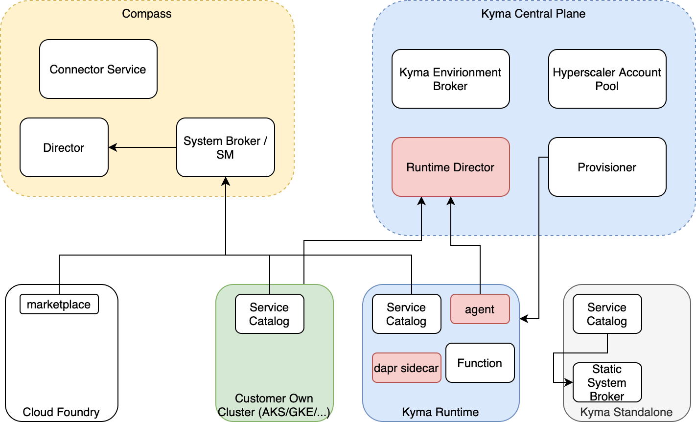

# KCP Runtime management - Concept

This document describes the concept of Runtime management using Kyma Control Plane and [Dapr](https://dapr.io).

## Architecture

This diagram shows the future architecture of the Kyma environment.
There are two central places, Compass and Kyma Control Plane, along with Runtimes that communicate with them.

### Compass

Compass is responsible for connecting applications to Runtimes, along with controlling and monitoring them.
The component called System Broker will be responsible for fetching data from different types of Runtimes, such as Cloud Foundry or customer Kubernetes cluster with Service Catalog installed. Then, System Broker will pass the data further to the Director component which will process it.  

### Kyma Control Plane

Kyma Control Plane is responsible for managing Kyma instances. It allows you to provision Kyma Runtimes and it's also a central place where Kyma instances can fetch their configuration from. The Runtime Governor component exposes the API for the Kyma Runtimes configuration.

### Runtimes

As shown in the diagram, these Runtimes will be supported:
- Cloud Foundry
- customer own Kubernetes cluster with Service Catalog installed
- managed Kyma Runtime
- standalone Kyma Runtime

Each supported Kyma instance has a dedicated Runtime Agent component that is responsible for handling the communication with Kyma Control Plane. The Runtime Agent component fetches the configuration from the Runtime Governor and applies it to the desired environment.

## Managing Runtimes configuration in Kyma Control Plane

The main idea is to have a component in Kyma Control Plane that will be a point of communication for Runtime Agents to manage the Runtimes. This component would be the image of Runtime Director. It would also allow for configuring Runtimes from one central place.

For example, the configuration could be passed as a URL with credentials to some external service, such as the logging service which is used by some of the registered Runtimes. In the case of managed Kyma Runtimes, after each Runtime fetched the new configuration, the Dapr bindings would be updated and populated to the Dapr sidecars.
