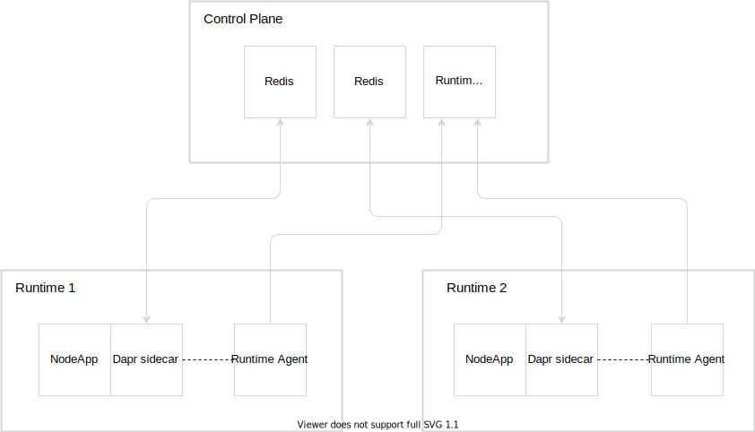
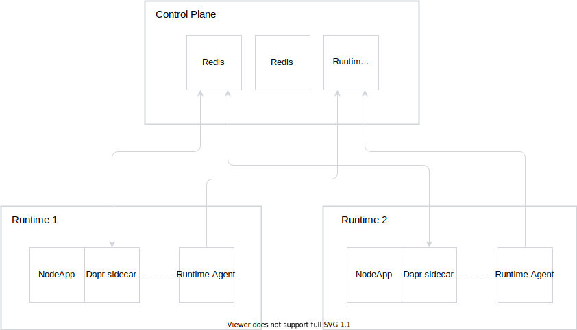

# Runtime Governor - Proof of Concept

This document describes the scenario that will be developed to prove that [Dapr](https://dapr.io/) sidecars can be configured from a central place.

## Reasons

- Kyma Runtimes must consume fewer resources. It can be achieved by delegating some of Kyma's responsibilities to Dapr. 
- Dapr injects sidecars into selected Pods where they fulfill their given tasks, such as state management or pub-sub.
- Configuration for these sidecars can be held in one central place from which Kyma Runtimes could fetch them and configure the sidecars accordingly.

## PoC scenario

The scenario will present two Runtimes using [Dapr State API](https://github.com/dapr/docs/blob/master/reference/api/state_api.md) to persist the state in two different Redis instances. It consist of the following steps:

1. Control Plane admin sets the configuration for two Runtimes.
2. Runtime Agents from both Runtimes fetch the configuration and create the Dapr component resources.
3. Control Plane admin changes the configuration.
4. Runtime Agents fetch the new configuration, apply it, and restart the Pods.
5. Both Runtimes use the new configuration.

As it's the Proof-of-Concept stage, we can use some temporary solutions, such as:
- Configuration held in memory instead of a database
- Pods being restarted by the Runtime Agent instead of a more complex solution

### Architecture



The image depicts the initial configuration of the components which will be deployed. After the successful reconfiguration, the architecture will look as follows:



Tools:
- [Docker](https://www.docker.com/)
- [k3d v3](https://github.com/rancher/k3d)
- [kubectl](https://kubernetes.io/docs/tasks/tools/install-kubectl/)
- [Helm 3](https://helm.sh/)
- watch (`brew install watch`)

Make sure that you have all the tools installed, and start in the `runtime-governor-poc` directory.

> **NOTE**: Keep in mind that some shells automatically escape some characters when copying and pasting commands. Always check the command before running it.

### Control Plane deployment

In the first step, we deploy the Control Plane cluster. It hosts the Runtime Governor component as well as two Redis instances for the purpose of persisting the state by the Runtimes.

To deploy the Control Plane cluster, run the following command:

```bash
./setup-cp.sh
```

You can watch the installation progress by looking at the statuses of the Pods that are deployed in the cluster:

```bash
watch kubectl --context=k3d-governor get po --all-namespaces
```

### Runtimes deployment

The next step is to deploy two Runtimes. They will consume the Control Plane API and persist the state in the Redis instances configured by the central Control Plane.

To deploy the first Runtime, run the following command. It will create the cluster and deploy a basic set of components, including the NodeApp that demos the use case with the state store.

```bash
./setup-runtime1.sh
```

You can watch the installation progress by looking at the statuses of Pods that are deployed in the cluster. At this stage, there should be a NodeApp Pod deployed, but the Dapr sidecar should not be injected yet.

```bash
watch kubectl --context=k3d-runtime1 get po --all-namespaces
```

Next, deploy the Runtime Agent component using the following command. It will deploy the Runtime Agent that connects to the Control Plane cluster and fetches the configuration for the given Runtime.

```bash
./setup-runtime1-agent.sh
```

You can watch the installation progress by looking at the statuses of Pods that are deployed in the cluster. After a successful deployment of the Runtime Agent component, it should fetch the configuration and apply it to the cluster. The NodeApp Pod should be recreated with the Dapr sidecar injected.

```bash
watch kubectl --context=k3d-runtime1 get po --all-namespaces
```

In order to deploy the second Runtime, run all the previous steps using the `runtime2` scripts.

### Use case scenario

The setup described gives you the possibility to interact with two Runtimes. 
On both Runtimes, there is an example Dapr NodeApp deployed. 
It exposes two endpoints, called `/order` and `/neworder`, which interact with the Redis state store. 
You can call these endpoints using a Docker container running in the same Docker network as the clusters. 

You can call the `/order` endpoint of Runtime 1 and Runtime 2 by running the following commands:

```bash
# Runtime 1
docker run --network=cpnet --rm --entrypoint curl curlimages/curl -iv http://${$(docker inspect k3d-runtime1-server-0 --format='{{json .NetworkSettings.Networks.cpnet.IPAddress}}')//\"}/order

# Runtime 2
docker run --network=cpnet --rm --entrypoint curl curlimages/curl -iv http://${$(docker inspect k3d-runtime2-server-0 --format='{{json .NetworkSettings.Networks.cpnet.IPAddress}}')//\"}/order
```

In order to call the `/neworder` endpoint, send the **POST** request with the JSON in the body. See the example of such calls for Runtime 1 and Runtime 2:

```bash
# Runtime 1
docker run --network=cpnet --rm --entrypoint curl curlimages/curl -iv http://${$(docker inspect k3d-runtime1-server-0 --format='{{json .NetworkSettings.Networks.cpnet.IPAddress}}')//\"}/neworder -d '{"data": {"orderId":"foo"}}' -H "Content-Type: application/json"

# Runtime 2
docker run --network=cpnet --rm --entrypoint curl curlimages/curl -iv http://${$(docker inspect k3d-runtime2-server-0 --format='{{json .NetworkSettings.Networks.cpnet.IPAddress}}')//\"}/neworder -d '{"data": {"orderId":"bar"}}' -H "Content-Type: application/json"
```

To prove that the Runtime configuration can be dynamically reloaded, change the configuration for Runtime 2 to point to the Redis 1 instance. To do so, run the following command:

```bash
CP_IPADDR=$(docker inspect k3d-governor-server-0 --format='{{json .NetworkSettings.Networks.cpnet.IPAddress}}'); REDIS1_PASSWORD=$(kubectl --context=k3d-governor get secret -n redis1-system redis -ojsonpath='{.data.redis-password}' | base64 -d) helm --kube-context=k3d-governor upgrade -i cp-governor -n cp-poc ./governor/chart \
  --set redis1.host=${CP_IPADDR//\"}:30000 --set redis1.password=$REDIS1_PASSWORD \
  --set redis2.host=${CP_IPADDR//\"}:30000 --set redis2.password=$REDIS1_PASSWORD
```

You can watch how the configuration is reloaded by the Runtime Agent on Runtime 2, and observe that the NodeApp Pod was restarted.

```bash
watch kubectl --context=k3d-runtime2 get po --all-namespaces
```

### Cleanup

To clean up the POC environment, use the following command:

```bash
./cleanup.sh
```

## Reloading configuration of Dapr sidecars 

We need to configure Dapr sidecars in a Kyma Runtime from one central Kyma Control Plane. However, Dapr sidecars have an [issue](https://github.com/dapr/dapr/issues/1172) concerning the fact that the whole Pod needs to restart for the configuration to be applied.

There are a few solutions to this problem.

### Control Plane Runtime Agent restarts every Pod with a Dapr sidecar

This solution may be the simplest, but it could add too many responsibilities for one component. A single Control Plane Runtime Agent would fetch the configuration, apply it, and then restart all Pods.

Pros:
- No new components in the Runtime 
- Less resource consumption

Cons:
- Too many responsibilites for one component

### New component responsible for restarting Pods

This solution adds a new component that will be triggered by the Runtime Agent and will restart Pods mentioned in the configuration.

Pros:
- Responsibilites distributed between components

Cons:
- Another component would definitely mean more resource consumption, which we want to avoid

### Dapr contribution allowing configuration reloading

This solution would surely be the most time-consuming. It seems like a really big change to the Dapr ecosystem and the approach to that [is still being discussed](https://github.com/dapr/dapr/issues/1172#issuecomment-610568718). We would have to create a proposal, wait for it to be accepted, and then develop the feature.

Pros:
- Out-of-the-box configuration reload 

Cons:
- Tremendous amount of work needed

## Related resources

For implementation details of the Runtime Governor, see the [README.md](./runtime-governor-poc/governor/component/README.md) document.
