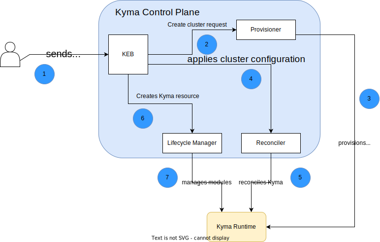

# Kyma Environment Broker architecture

The diagram and steps describe the Kyma Environment Broker (KEB) workflow and the roles of specific components in this process:

1. The user sends a request to create a new cluster with Kyma Runtime.

2. Kyma Environment Broker proxies the request to create a new cluster to the Runtime Provisioner component.

3. Provisioner creates a new cluster.

4. Kyma Environment Broker creates a cluster configuration in Reconciler (except for the preview plan).

5. Reconciler installs Kyma (except for the preview plan). 

6. Kyma Environment Broker creates Kyma resource (only for the preview plan).

7. Lifecycle Manager manages Kyma modules (only for the preview plan).

