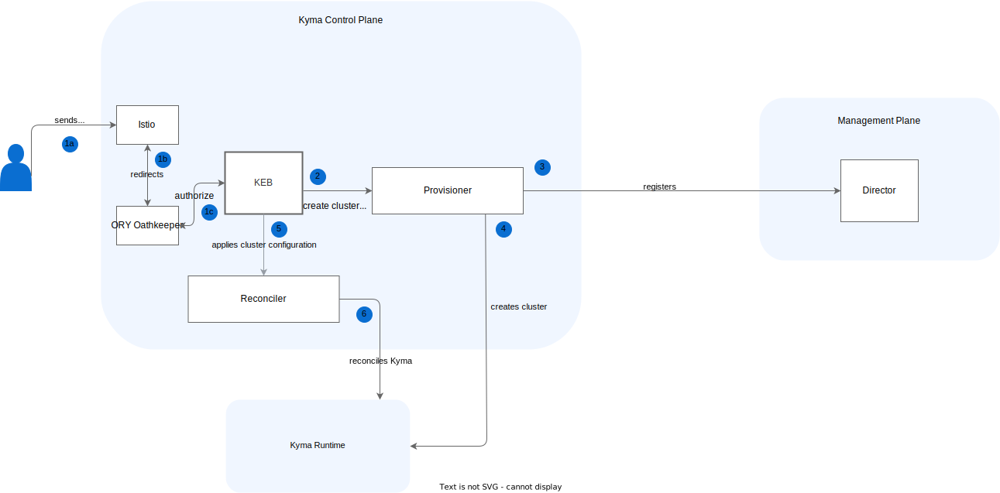

# Kyma Environment Broker architecture

The diagram and steps describe the Kyma Environment Broker (KEB) workflow and the roles of specific components in this process:

1. The user sends a request to create a new cluster with [Kyma Runtime](https://github.com/kyma-incubator/compass/blob/master/docs/compass/02-01-components.md#kyma-runtime).

    a. The user sends a request to KEB through [Istio VirtualService](https://istio.io/docs/reference/config/networking/virtual-service/).

    b. Istio redirects the request to the [Ory Oathkeeper](https://www.ory.sh/oathkeeper/docs/), which authorizes the request.

    c. If the authorization ends with success, the request is redirected to KEB.

2. KEB proxies the request to create a new cluster to the Runtime Provisioner component.

3. Provisioner registers a new cluster in the Director component.

4. Provisioner creates a new cluster and installs Kyma Runtime (for Kyma 1.x).

5. KEB creates a cluster configuration in the Reconciler (for Kyma 2.x).

6. Reconciler installs Kyma (for Kyma 2.x).  

