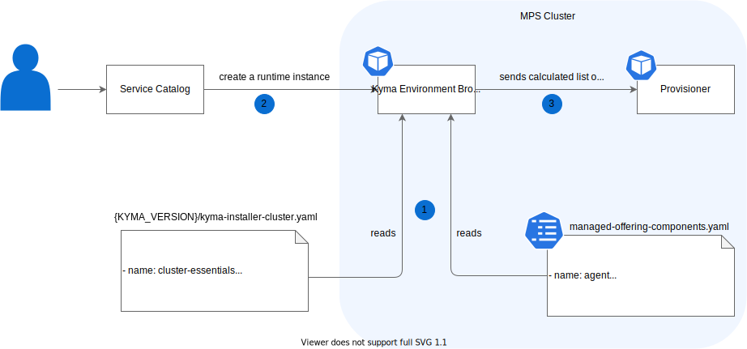

# Runtime components

Kyma Environment Broker (KEB) serves the functionality of composing the list of components that are installed in a Runtime. The diagram and steps describe the KEB workflow in terms of calculating and processing Runtime components:



1. During KEB initialization, the broker reads two files that contain lists of components to be installed in a Runtime:  

   * `kyma-installer-cluster.yaml` file with the given Kyma version
   * `managed-offering-components.yaml` file with additional managed components that are added at the end of the base components list

2. The user provisions a Runtime and selects optional components that they want to install.

3. KEB composes the final list of components by removing components that were not selected by the user. It also adds the proper global and components overrides and sends the whole provisioning information to the Runtime Provisioner.

There is a defined [list of the component names](https://github.com/kyma-project/control-plane/blob/main/components/kyma-environment-broker/internal/runtime/components). Use these names in your implementation.

## Disabled components

To disable a component for a [specific plan](03-01-service-description.md#service-plans), add it to the [disabled components list](https://github.com/kyma-project/control-plane/blob/main/components/kyma-environment-broker/internal/runtime/disabled_components.go).
To disable a component for all plans, add its name under the **AllPlansSelector** parameter.

## Optional components

An optional component is a component that is disabled by default but can be enabled in the [provisioning request](08-01-provisioning-kyma-environment.md). Currently, the optional components are:

* Kiali
* Tracing

### Add the optional component

If you want to add the optional component, you can do it in two ways.

* If disabling a given component only means to remove it from the installation list, use the generic disabler:

```go
runtime.NewGenericComponentDisabler("component-name", "component-namespace")
```

* If disabling a given component requires more complex logic, create a new file called `internal/runtime/{compoent-name}_disabler.go` and implement a service which fulfills the following interface:

```go
// OptionalComponentDisabler disables component form the given list and returns a modified list
type OptionalComponentDisabler interface {
	Disable(components internal.ComponentConfigurationInputList) internal.ComponentConfigurationInputList
```

>**NOTE**: Check the [CustomDisablerExample](https://github.com/kyma-project/control-plane/blob/main/components/kyma-environment-broker/internal/runtime/custom_disabler_example.go) as an example of custom service for disabling components.

In each method, the framework injects the  **components** parameter which is a list of components that are sent to the Runtime Provisioner. The implemented method is responsible for disabling component and as a result, returns a modified list.

This interface allows you to easily register the disabler in the [`cmd/broker/main.go`](https://github.com/kyma-project/control-plane/blob/main/components/kyma-environment-broker/cmd/broker/main.go) file by adding a new entry in the **optionalComponentsDisablers** list:

```go
// Register disabler. Convention:
// {component-name} : {component-disabler-service}
//
// Using map is intentional - we ensure that component name is not duplicated.
optionalComponentsDisablers := runtime.ComponentsDisablers{
		"Kiali":      runtime.NewGenericComponentDisabler(components.Kiali),
		"Tracing":     runtime.NewGenericComponentDisabler(components.Tracing),
}
```

### Remove the optional component

If you want to remove the option to disable components and make them required during Kyma installation, remove a given entry from the **optionalComponentsDisablers** list in the [`cmd/broker/main.go`](https://github.com/kyma-project/control-plane/blob/main/components/kyma-environment-broker/cmd/broker/main.go) file.
