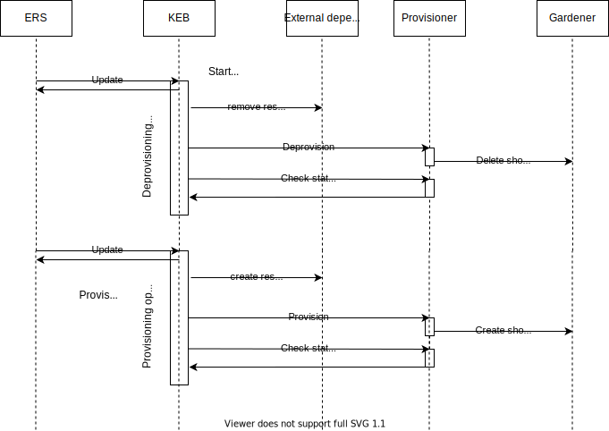

Kyma Environment Broker provides a possibility for `context update` operation described in the [OSB API](https://github.com/openservicebrokerapi/servicebroker/blob/v2.16/spec.md#updating-a-service-instance). It allows to change the flag `active` by the platform.
A trial global account could be suspended in the SAP CP. It triggers a context update with proper value of the `active` flag.
The broker deletes the cluster for such global account but keeps all necessary data (for example shoot name). The unsuspension triggers provisioning a new cluster with the same domain.
The global account suspension (unsuspension) triggers deprovisioning (provisioning) operation in Kyma Environment Broker.

 

ERS makes a request according to the OSB API, for example:
```bash
curl --location --request PATCH 'kyma-environment-broker.url.com/oauth/cf-eu10/v2/service_instances/pm_trial_susp026?service_id=47c9dcbf-ff30-448e-ab36-d3bad66ba281&plan_id=7d55d31d-35ae-4438-bf13-6ffdfa107d9f' \
--header 'X-Broker-API-Version: 2.14' \
--header 'Content-Type: text/plain' \
--data-raw '{
       "service_id": "47c9dcbf-ff30-448e-ab36-d3bad66ba281",
       "plan_id": "7d55d31d-35ae-4438-bf13-6ffdfa107d9f",
       "context": {
           "globalaccount_id": "c5529650-fecb-4fa7-afef-a1024328ea4e",
           "subaccount_id": "subaccount-id",
           "active":false
       },
       "parameters": {
           "name": "cluster-name"
       }
   }'
```

Kyma Environment Broker exposes a `runtimes/` endpoint which allows us to check SKRs.
The response contains two new types of operations: suspension and unsuspension.

```json
{
  "data": [
    {
      "instanceID": "pm-trial-susp-022",
      "runtimeID": "6e8e2b64-0d80-431e-bc02-bdd91c0818c0",
      "globalAccountID": "51e70e7b-a61c-461e-b3ae-592db84a15bd",
      "subAccountID": "pm-trial-susp-022",
      "region": "westeurope",
      "subAccountRegion": "cf-eu10",
      "shootName": "c-5a5cc44",
      "serviceClassID": "47c9dcbf-ff30-448e-ab36-d3bad66ba281",
      "serviceClassName": "kymaruntime",
      "servicePlanID": "7d55d31d-35ae-4438-bf13-6ffdfa107d9f",
      "servicePlanName": "trial",
      "status": {
        "createdAt": "2021-01-13T04:56:37.447622Z",
        "modifiedAt": "2021-01-13T07:42:27.666004Z",
        "provisioning": {
          "state": "succeeded",
          "description": "Operation created : Operation succeeded",
          "createdAt": "2021-01-13T04:56:37.442657Z",
          "operationID": "d7856054-2486-4d4a-bc9e-3a135d344fcd"
        },
        "deprovisioning": {
          "state": "in progress",
          "description": "Operation created",
          "createdAt": "2021-01-14T07:34:30.850788Z",
          "operationID": "02f46fcf-23a1-482d-a652-a6c60c8e0962"
        },
        "upgradingKyma": {
          "data": [],
          "totalCount": 0,
          "count": 0
        },
        "suspension": {
          "data": [
            {
              "state": "succeeded",
              "description": "Operation created : Operation succeeded",
              "createdAt": "2021-01-13T05:48:32.265046Z",
              "operationID": "42ce405a-e5fd-4adc-996c-0e4b930698aa"
            }
          ],
          "totalCount": 1,
          "count": 1
        },
        "unsuspension": {
          "data": [
            {
              "state": "failed",
              "description": "Operation created : operation has reached the time limit: 4h0m0s",
              "createdAt": "2021-01-13T07:14:36.149338Z",
              "operationID": "06b161af-a1c4-46e0-8814-de8f801d989a"
            }
          ],
          "totalCount": 1,
          "count": 1
        }
      }
    }
  ],
  "count": 1,
  "totalCount": 1
}
```
