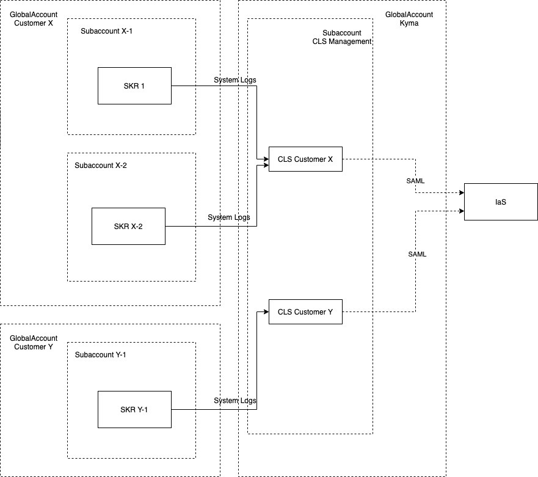

The image below explains the account setup for SKR and CLS instances

The CLS instances are created inside a sub account inside the Kyma Global Account. There is one CLS instance created for every customer SKR global account. This CLS instance is created for a given customer Global account when the customer provision first SKR instance.

From the diagram above we can see when customer with Global Account X provisions first SKR (SKR 1) this would provsion a CLS instance (CLS for customer X) in the CLS sub account which is part of kyma global account. After provision of CLS instance, a binding is created and the credentials are passed over to SRK 1 so that the logs could be pushed to the CLS instance.

On subsequent provision of SKR (eg SKR X-2) within the same global account there is no new CLS instance provisioned rather the existing CLS instance is used by creating a new binding (which would create a new set of crednetials to access the CLS instnace). These new set of credentials are passed over to SKR X-2, so that it can push logs to CLS instance.

The Kibana of each of the CLS instance requires SAML authentiacation to access.